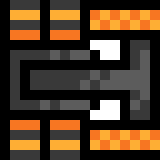

# TANK ESCAPE

### Tank escape is a free to play puzzle - action game with 2D pixel art graphics

### What to expect

- Intense situations, from the skin of your teeth
- 16 Levels
- Infinite replayability
- 1980 games level difficulty
- Shop with multiple upgrades
- High quality skins

### How to play
To play either download the **compiled** version or install [**Python 3.8**](https://www.python.org/downloads/) and all necessary modules listed in requirements.txt. After that simply run the program.

### How to edit save data
#### MacOS:
- Right click and open package contents
- Inside package contents open the **"save.json"** file

#### Windows:
- Windows version not available

#### Linux:
- Linux version not available

### How to edit save data cont'

##### Level
Level determines the current level the player is on **NOT** the max level

##### Coins
Coins are the code version for research points

##### CoinsSpecial
CoinsSpecial's are the code version for rebirth spheres (The blue orb). Would not recommend editing them as they are meant to be linked to CoinsSpecialPure.

##### CoinsSpecialPure
CoinsSpecialPure's are the max amount of rebirth spheres (CoinsSpecial / the blue orb). This is used to reset it to max after you lose all +++ upgrades (max level upgrades)

### Shop
Shop is split into 6 parts.

##### Name
Determines the name for the shop item

##### Cost
Determines the cost for it. If the level is 2 it's in rebirth spheres, else it is in research points.

##### Can buy
If you can buy the item (true means it's not bought and you can buy)

##### Unlocked
Determines if the item is unlocked (true means you can buy it, false means you can't)

##### Level
Determines what banner it uses and what currency it uses. (0 - 1 = Coins) (2 - ? = Rebirth Spheres)